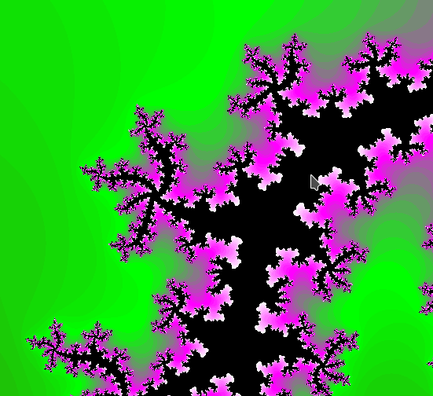

# xmand with arbitrary precision floating point calculations with NTL

This project is based on the ../xmand, but converted to C++ and it uses the
[NTL lib](https://www.shoup.net/ntl/) to calculate mandelbrot images with
arbitrary precision. For this there is an additional last parameter to specify
the number of bits which should be used for the floating point calculations.
The default is 53 bits, which is the same as double on many machines.

The reason to use higher precision numbers is because at high zoom levels,
many pixels of the image has the same height with standard double.
An example rendered with normal double:

```
./xmand 4096 1000000000000000 -5.049444741429e-01 -6.106438428247e-01
```

Output:


With the new NTL version, you can specify the number of bits as the last parameter.
For example if you want 100 bits precision, you call it like this:

```
./xmand 4096 1000000000000000 -5.049444741429e-01 -6.106438428247e-01 100
```

This results in the following picture for the same region:


